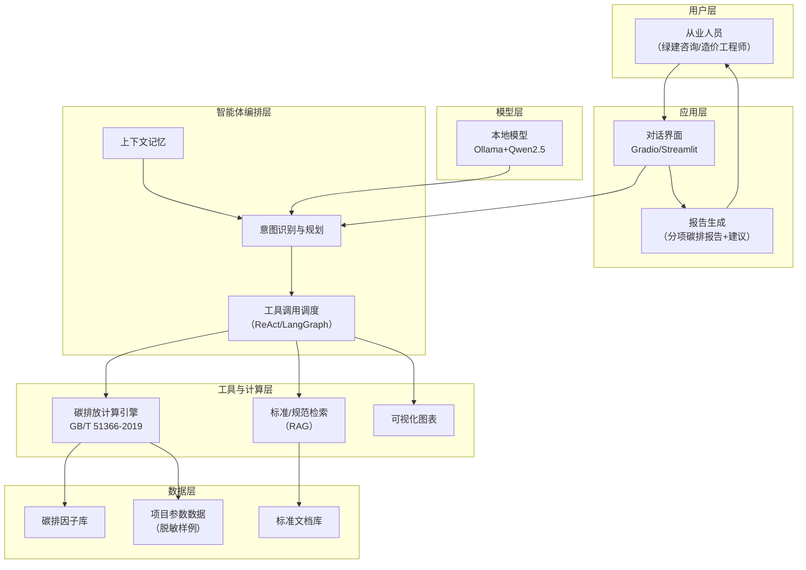

# 1 页技术架构图模板

## 一、必备要素（评审视角逐项自查）

1. **分层结构**（自上而下）：用户层 → 应用层 → 智能体编排层 → 工具与计算层 → 数据层 → 模型层
2. **数据流标注**：每条关键数据通路用箭头 + 文字说明（数据从哪来 → 经哪模块 → 输出到哪）
3. **核心模块命名**：与申报书技术方案、演示视频里的系统名称完全一致
4. **一页原则**：A4 横向或 16:9，信息密度适中，评审放大 200% 仍清晰
5. **边界标注**：本地部署部分 vs 云端服务部分分开标注（答辩讲得清）

## 二、Mermaid 初稿示例（可转 SVG/HTML 美化）

## 三、绘制规范

- **工具**：draw.io / Excalidraw 导出 PNG/SVG（最终图用矢量，放大不糊）；Mermaid 出初稿
- **配色**：分层用同一色系深浅区分，数据流箭头用高对比色；避免大段文字堆在框里（每框 ≤ 8 字 + 括号说明）
- **数据流文字**：在箭头上标"参数输入""计算结果""因子查询"等动作词
- **检查**：打印 A4 检查字号；找队友盲读 30 秒能否讲清数据流向
