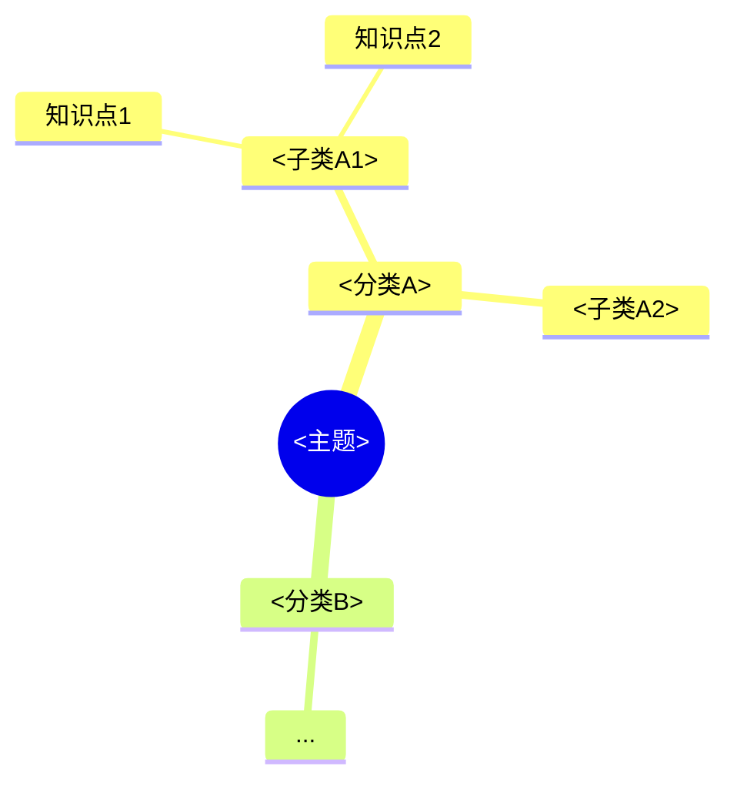
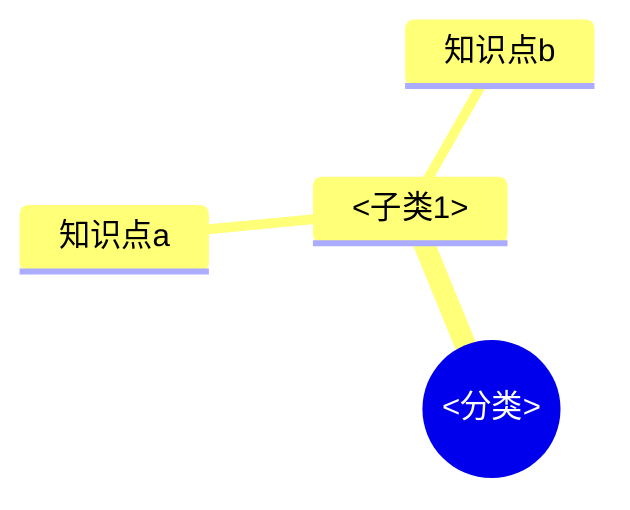

# 模板参考（Material to Knowledge Base）

本文件供 SKILL.md 工作流引用，撰写笔记时按此结构输出。

## 知识点笔记模板

```markdown
---
tags: [<主题>, <分类>, <子分类>]
source: [<来源文件名1>, <来源文件名2>]
created: YYYY-MM-DD
status: draft
review_status: new            # new / learning / review / mastered
next_review: YYYY-MM-DD       # 首次 = created 次日；复习后按间隔更新
---

# <知识点标题>

## 一句话概括
...

## 核心内容
- ...

## 要点 / 例子
- ...

## 前置知识（需要先掌握）
[[知识点A]] —— 一句话说明为什么需要
[[知识点B]]

## 关联知识点
[[知识点C]]（并列/延伸） [[知识点D]]

## 自我检测（闪卡）
- **Q**: 问句（考点式）
  **A**: 简答
- **Q**: ...
  **A**: ...

## 来源资料
- `<文件名1>`：第 X 章 / 页码 P.XX（如可定位）
- `<文件名2>`：...

## 关联笔记
[[_MOC]]
```

## _知识谱系.md（全库总谱系，Mermaid mindmap）



## 分类 _总览.md（分类层先总）

```markdown
# <分类> 总览

## 子谱系


## 知识点索引
- [[知识点a]] —— 一句话
- [[知识点b]]

## 推荐学习顺序
1. 知识点a（前置）
2. 知识点b
```

## _log.md（增量日志，append-only）

```markdown
# 增量日志（append-only）

- YYYY-MM-DD：初始建库（主题 <主题>，处理 N 份资料，谱系 M 大类 / K 知识点）
- YYYY-MM-DD：新增《<笔记>》于 <分类>/<子分类>（来源 <文件>）
- YYYY-MM-DD：追加资料 <文件>，新增知识点《<知识点>》
```

## 99-原始资料索引/资料清单.md

```markdown
# 资料清单

| 文件 | 类型 | 大小 | 角色预判 | 提取状态 | 备注 |
|---|---|---|---|---|---|
| <文件名> | PDF/Word/MD | <大小> | 讲义/真题/... | 已提取 / 待OCR / 待处理 | 章节数/页数 |
```
