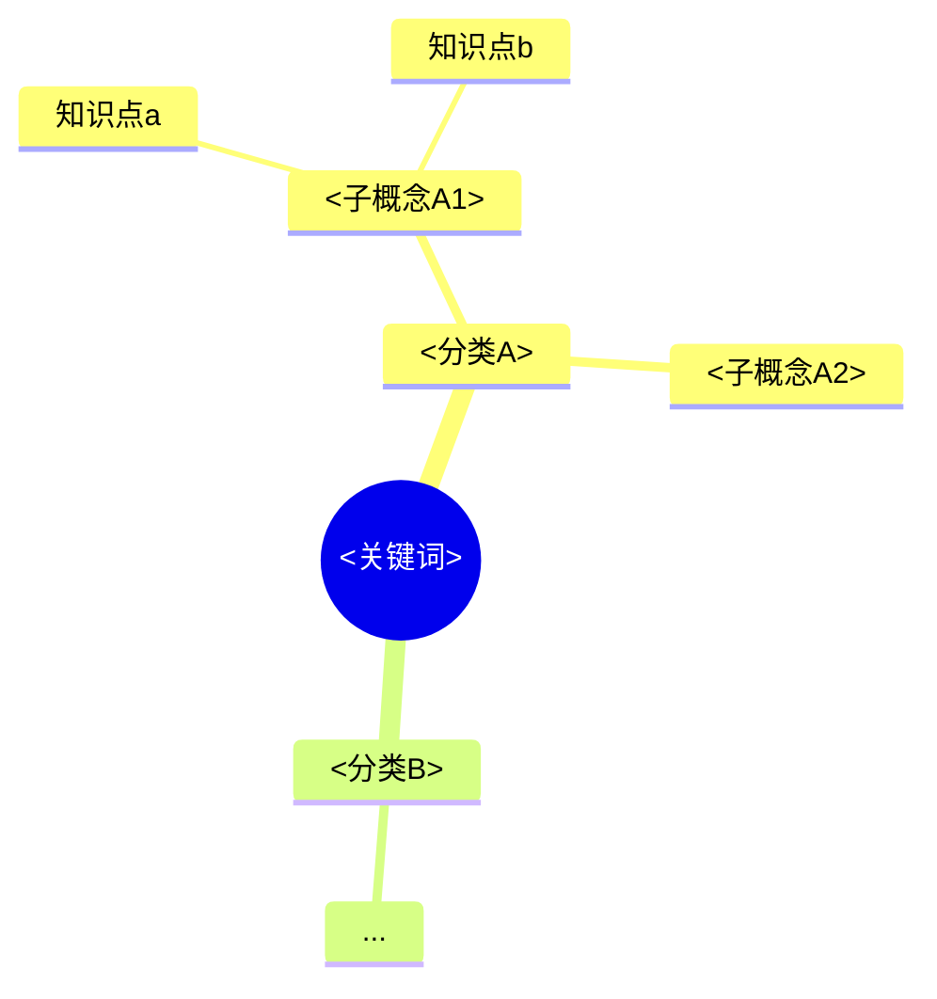
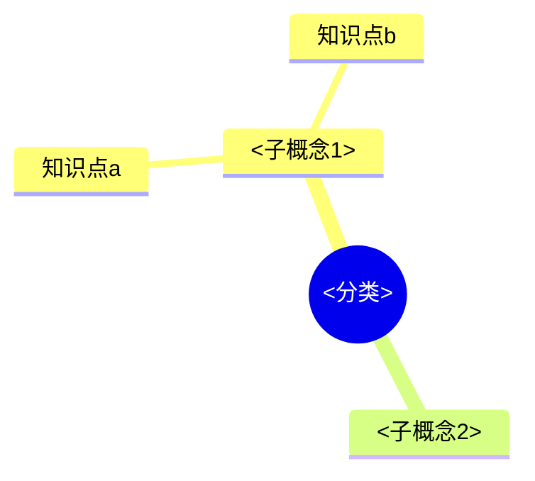

# 模板参考（Topic Knowledge Base）

本文件供 SKILL.md 工作流引用，撰写笔记时按此结构输出。

## 知识点笔记模板

```markdown
---
tags: [<关键词>, <分类>]
source: [<来源URL1>, <来源URL2>]
created: YYYY-MM-DD
status: draft
---

# <标题>

## 一句话概括
...

## 核心内容
- ...

## 要点 / 例子
- ...

## 相关链接
- [来源1](<url>)
- [来源2](<url>)

## 关联笔记
[[_MOC]]
```

## _知识谱系.md（全库总谱系，Mermaid mindmap）



## 分类 _总览.md（分类层先总）

```markdown
# <分类> 总览

## 子谱系


## 知识点索引
- [[知识点a]] —— 一句话
- [[知识点b]]

## 推荐学习顺序
1. 知识点a（前置）
2. 知识点b
```

## _log.md（增量日志，append-only）

```markdown
# 增量日志（append-only）

- YYYY-MM-DD：初始建库（谱系 N 大类 / M 子类 / K 知识点）
- YYYY-MM-DD：新增《<笔记>》于 <分类>/<子分类>
- YYYY-MM-DD：补充 <分类> 的《<知识点>》内容
```
